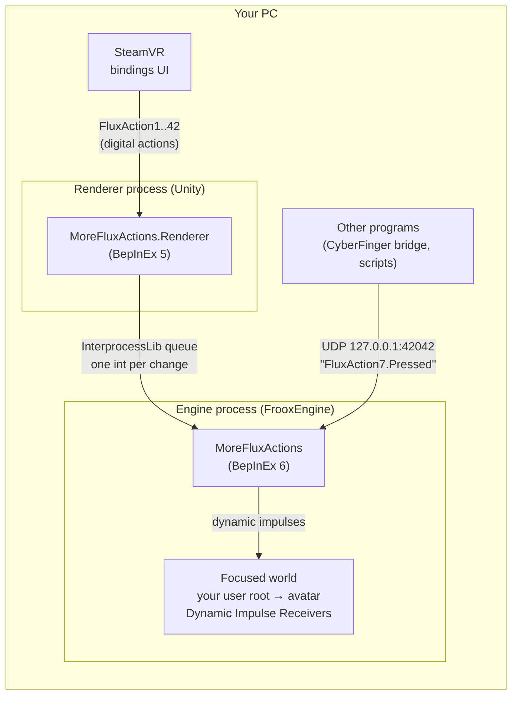

# Architecture

MoreFluxActions turns a button press, on any SteamVR controller or from any program on your PC, into a ProtoFlux
dynamic impulse on your avatar. This page explains how it gets there, and why it is built that way.

## The problem: input lives in another process

Since Resonite split its renderer into a separate process, it runs as two programs:

| Process | What it is | Mod loader |
|---|---|---|
| **Engine** (`Resonite.exe`) | FrooxEngine on .NET 10: worlds, users, ProtoFlux | BepInEx 6, through BepisLoader |
| **Renderer** (`Renderite.Renderer.exe`) | Unity: drawing, and **SteamVR input**, through Valve's SteamVR Unity plugin | BepInEx 5, through BepInExRenderer |

The renderer reads SteamVR's actions and hands the engine a fixed set of per-controller states: trigger, grip,
stick, and so on. An action Resonite doesn't define never reaches the engine, so ProtoFlux can't see it. The mod
therefore has two halves, one in each process, joined by a shared-memory queue.

## The renderer half: `MoreFluxActions.Renderer`

It uses three Harmony patches on Valve's `CVRInput` wrapper ([SteamVRPatches.cs](../MoreFluxActions.Renderer/SteamVRPatches.cs)):

1. **`SetActionManifestPath` (prefix): a bigger action manifest.** When Resonite hands SteamVR its action
   manifest, the mod reads it and adds:
   - an action set `/actions/FluxActions` (usage `single`);
   - 42 optional boolean actions, `/actions/FluxActions/in/FluxAction1` … `FluxAction42`;
   - English names ("Flux Actions (ProtoFlux on your avatar)", "Flux Action 7") for SteamVR's bindings UI.

   It writes the result, with copies of Resonite's default bindings, to
   `<profile>/Renderer/BepInEx/config/MoreFluxActions/actions.json`, and passes that path to SteamVR instead.
   Only the native call is redirected. Resonite's own actions are untouched, so its bindings keep working.
2. **`UpdateActionState` (prefix): the set is always active.** SteamVR only delivers the action sets an app asks
   for each frame. The mod appends `FluxActions` to Resonite's list. It isn't restricted to a device, so any
   controller's binding counts. The list is copied every frame, because Valve's plugin reuses its arrays.
3. **`UpdateActionState` (postfix): read and forward.** After each update it reads the 42 actions with
   `GetDigitalActionData`. On every change, press or release, it sends one `int` to the engine: `(action << 1) | pressed`.

[RendererPlugin.cs](../MoreFluxActions.Renderer/RendererPlugin.cs) owns the connection. It connects to the
engine's queue and retries every 2 s until the engine half has created it. Events that arrive before the
connection are queued, up to a limit.

## The engine half: `MoreFluxActions`

[Plugin.cs](../MoreFluxActions/Plugin.cs) creates the queue once the engine is ready, and listens on two inputs:

- **The renderer's queue:** Nytra's [InterprocessLib](https://thunderstore.io/c/resonite/p/Nytra/InterprocessLib/)
  `Messenger`. The queue name carries a hash of the `-shmprefix` both processes are started with, so two
  Resonite instances on one PC don't cross.
- **UDP on `127.0.0.1:42042`:** one ASCII datagram per change, naming the impulse (`FluxAction42.Pressed` or
  `FluxAction42.Released`). It binds the loopback address only, so nothing on the network can reach it. Any
  program on your PC can. This is how the CyberFinger bridge fires a FluxAction from the right pink button,
  and how the test rigs are checked without anyone pressing a button.

Each event is handed to the **focused world**'s update (`World.RunSynchronously`). There, under
`world.LocalUser.Root.Slot` (your user root, which holds your avatar), it fires:

| Impulse | Receiver node | When |
|---|---|---|
| `FluxActionN.Pressed` | Dynamic Impulse Receiver | the button goes down |
| `FluxActionN.Released` | Dynamic Impulse Receiver | the button goes up |
| `FluxActionN` with a `bool` | Dynamic Impulse Receiver With Value `<bool>` | both: `true` on press, `false` on release |

The first press of each action is logged with the number of receivers that answered, for example
`FluxAction1 pressed: 1 receiver(s) under User … in <world>`.

## What follows from this design

- **Receivers must be under your user root.** Dynamic impulses travel down the hierarchy from the slot they're
  fired at. Your avatar sits there, so anything saved on the avatar works in every world. A receiver in a
  world object does not hear them. To reach one, forward the impulse: see [developing.md](developing.md#reaching-things-outside-your-avatar).
- **Disabled slots don't receive.** The impulses are fired with `excludeDisabled`. A receiver under an inactive
  slot stays silent, which also makes an easy on/off switch for a set of actions.
- **Only the focused world, only your client.** Impulses fire in the world you're in, on your own client, like
  any dynamic impulse. Whatever the flux then writes (a field, a slot's active state) syncs to everyone as usual.
- **SteamVR input needs Resonite focused.** SteamVR gives input to the focused VR app only. UDP events don't
  care about focus.
- **Nothing to set up per world.** The action set and the impulses come from the mod. The ProtoFlux is yours,
  saved on your avatar or built by a script.

## Why not…

- **…map the buttons in the engine alone?** The engine never sees SteamVR actions, only the renderer's fixed
  controller states. A new action has to be read where SteamVR is: in the renderer.
- **…fire the impulses at the world root?** Every user's FluxActions would then reach every world object, and
  one user's buttons would drive another user's avatar gear. Firing at your own user root keeps it personal.
  Forwarding to a world object is one node away when you want it.
- **…use SteamVR for the bridge's buttons too?** A SteamVR binding is fixed when you make it. The bridge lets
  you pick the action number at run time, so it talks to the mod directly over UDP.

## Files

| Path | What |
|---|---|
| `Shared/FluxActionProtocol.cs` | What both halves agree on: count (42), action paths, impulse tags, the int encoding, the queue name, the UDP port and datagram parser |
| `MoreFluxActions.Renderer/` | The renderer half: manifest extension, action reading, queue client |
| `MoreFluxActions/` | The engine half: queue owner, UDP listener, impulse firing |
| `tools/` | Python over ResoniteLink: [the test rigs](examples.md) and the `fluxlink` builder for [your own](developing.md) |
